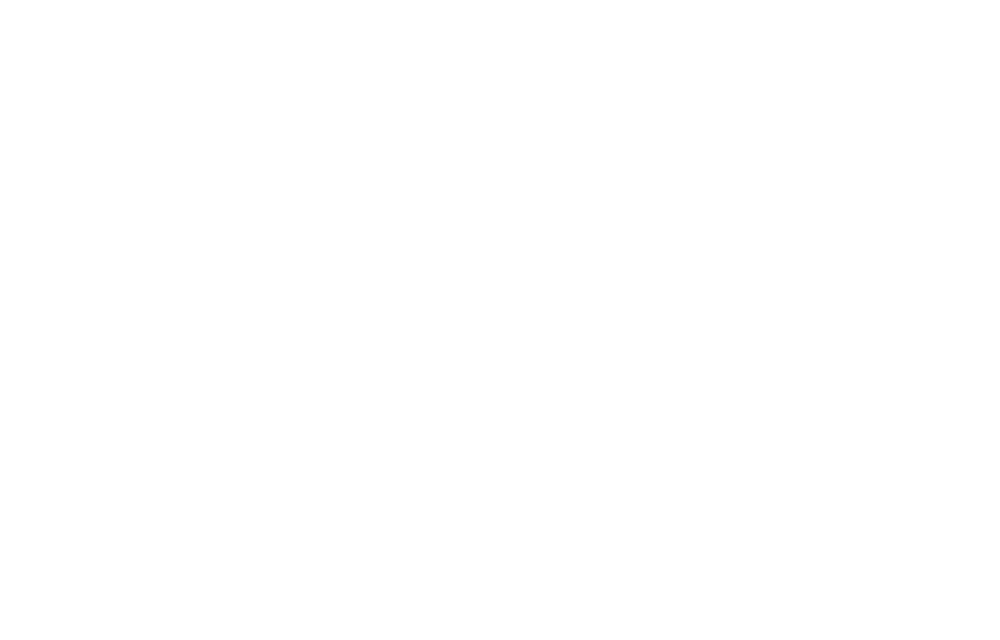

<div align="center">

# **SubVortex Auto Upgrader** <!-- omit in toc -->

[](https://github.com/eclipsevortex/SubVortex.AutoUpgrader/actions/workflows/docker-workflow.yml)
[](https://discord.gg/bittensor)
[](https://opensource.org/licenses/MIT)

---

## Effortless Updates for Your Miner & Validator <!-- omit in toc -->

[Github]() [Discord](https://discord.gg/bittensor) • [Network](https://taostats.io/) • [Research](https://bittensor.com/whitepaper)

---

<div>
  
</div>
<br />
<div style="font-size: 20px">Testnet: 92 • Mainnet: 7</div>

</div>

---

- [Introduction](#introduction)
- [Prerequisites](#prerequisites)
- [How It Works](#how-it-works)
- [Quick Start](#quick-start)
- [Quick Stop](#quick-stop)
- [Quick Upgrade](#quick-upgrade)
- [Installation](#installation)
  - [Run as Process](#run-as-process)
  - [Run as Service](#run-as-service)
  - [Run as Container](#run-as-container)
- [Upgrade](#upgrade)
- [Uninstallation](#uninstallation)
  - [Remove Process](#remove-process)
  - [Remove Service](#remove-service)
  - [Remove Container](#remove-container)

<br />
<br />

# 🚀 Introduction <a id="introduction"></a>

Keeping your miner and validator up to date shouldn't be a chore.

The **SubVortex Auto Upgrader** automates upgrades for your SubVortex miner and validator. It ensures that your components are always running the latest version—without manual intervention.

Whether you're managing a single node or an entire fleet, the Auto Upgrader provides a reliable and flexible solution. Choose to run it as a standalone process, a system service, or in a Docker container.

Simple to set up. Easy to monitor. Zero stress upgrades.

<br />

# ⚙️ Prerequisites <a id="prerequisites"></a>

> ⚠️ **Architecture Notice**  
> The SubVortex Auto Upgrader currently supports only **x86_64 (amd64)** servers.  
> `arm64` support is not yet available but is a work in progress.  
> We’re actively collaborating with OTF to bring full compatibility as soon as possible.

Before you begin, make sure you clone the Auto Upgrader repository:

```bash
git clone https://github.com/eclipsevortex/SubVortex.AutoUpgrader.git
```

Then, configure your environment:

1. Update the environment variables inside the `subvortex/auto_upgrader/environment/` folder.

   - For miners, edit files matching `env.subvortex.miner.*`
   - For validators, edit files matching `env.subvortex.validator.*`

2. Update the main Auto Upgrader `.env` file at:
   ```
   subvortex/auto_upgrader/.env
   ```

Here's a breakdown of the key variables:

- **SUBVORTEX_PRERELEASE_ENABLED**:  
  Set to `true` if you want the Auto Upgrader to apply both releases and pre-releases. Default is `false`.

- **SUBVORTEX_EXECUTION_METHOD**:  
  Defines how the Auto Upgrader runs. Options are `process`, `service`, or `docker`. Default is `service`.

- **SUBVORTEX_PRERELEASE_TYPE**:  
  Specifies a single prerelease identifier you want to be notified about. Options are `alpha` or `rc` (**use ONLY in TESTNET**). Remove this variable to receive notifications from `latest` (**use in MAINNET**) prerelease types. Default is an empty string, which disables prerelease notifications.

- **SUBVORTEX_EXECUTION_ROLE**:  
  Specifies the type of neuron running on this machine. Options are `miner` and `validator`. Default value is `miner`. The Auto Upgrader uses this to decide how the machine should upgrade.

- **SUBVORTEX_WORKING_DIRECTORY**:  
  Working directory used by the Auto Upgrader. Recommended default: `/var/tmp/subvortex`

- **SUBVORTEX_CHECK_INTERVAL**:  
  Interval in seconds to check if new releases are available. Default 30 seconds.

<br />

# 🔧 How It Works <a id="how-it-works"></a>

When setting up the Auto Upgrader, you can choose from three execution modes: `process`, `service`, or `docker`. The default mode is `service`

🧩 Process & Service Modes

In these modes, the Auto Upgrader checks GitHub every **SUBVORTEX_CHECK_INTERVAL** seconds for new releases. When a new version is available, it:

1. Downloads and unzips the archive for your neuron type (**SUBVORTEX_EXECUTION_ROLE**) into **SUBVORTEX_WORKING_DIRECTORY**
2. Install the new version
3. Updates the symlink to point to the new version
4. Cleans up the previous version

🐳 Docker Mode

Here, the Auto Upgrader also checks GitHub every **SUBVORTEX_CHECK_INTERVAL** seconds. When a new release is found:

1. It pulls the floating tag that matches your desired release type (**SUBVORTEX_PRERELEASE_TYPE**)
2. It starts the updated container

Note: In Docker mode, the Auto Upgrader only runs if the neuron isn’t installed or during rollback to version 2.3.3. Outside of that, upgrade responsibilities are delegated to Watchtower for seamless updates.

<br />

# 🚀 Quick Start <a id="quick-start"></a>

To install the Auto Upgrader in a quick way, you can run

```bash
./scripts/quick_start.sh
```

It will install and start the Auto Upgrader as service which is the default mode.

Use `-h` to see the options

# 🛑 Quick Stop <a id="quick-stop"></a>

To stop the Auto Upgrader in a quick way, you can run

```bash
./scripts/quick_stop.sh
```

It will stop and teardown the Auto Upgrader.

Use `-h` to see the options

<br />

# 🔄 Quick Upgrade <a id="quick-upgrade"></a>

To upgrade the Auto Upgrade when a new release has been deployed, you can run

```bash
./scripts/auto_upgrader/auto_upgrader_upgrade.sh
```

<br />

# 🛠️ Installation <a id="installation"></a>

You can install the Auto Upgrader in one of three ways:

- As a **process** (using PM2)
- As a **system service** (using systemd)
- As a **container** (using Docker)

## ▶️ Run as Process <a id="run-as-process"></a>

1. Set the execution method in `.env`:

```env
SUBVORTEX_EXECUTION_METHOD=process
```

2. Run the setup script:

```bash
./subvortex/auto_upgrader/deployment/process/auto_upgrader_process_setup.sh
```

3. Start the Auto Upgrader:

```bash
./subvortex/auto_upgrader/deployment/process/auto_upgrader_process_start.sh
```

4. Verify it's running:

```bash
pm2 list
```

You should see a process named `subvortex-auto-upgrade`.

To check logs:

```bash
pm2 log subvortex-auto-upgrade
```

## 🛡️ Run as Service <a id="run-as-service"></a>

1. Set the execution method in `.env`:

```env
SUBVORTEX_EXECUTION_METHOD=service
```

2. Run the setup script:

```bash
./subvortex/auto_upgrader/deployment/service/auto_upgrader_service_setup.sh
```

3. Start the Auto Upgrader:

```bash
./subvortex/auto_upgrader/deployment/service/auto_upgrader_service_start.sh
```

4. Check the service status:

```bash
systemctl status subvortex-auto-upgrader
```

You should see something like

```bash
Loaded: loaded (/etc/systemd/system/subvortex-auto-upgrader.service; enabled; vendor preset: enabled)
     Active: active (running) since Thu 2025-04-10 11:51:27 BST; 6s ago
   Main PID: 2229560 (python3)
      Tasks: 10 (limit: 28765)
     Memory: 57.9M
        CPU: 1.592s
     CGroup: /system.slice/subvortex-auto-upgrader.service
             └─2229560 /root/SubVortex.AutoUpgrader/subvortex/auto_upgrader/venv/bin/python3 -m subvortex.auto_upgrader.src.main
```

To view logs:

```bash
tail -f /var/log/subvortex-auto-upgrader/subvortex-auto-upgrader.log
```

## 🐳 Run as Container <a id="run-as-container"></a>

Before installing the Auto Upgrader as a container, be sure you have docker installed. If not, you can run

```bash
./scripts/docker/docker_setup.sh
```

1. Set the execution method in `.env`:

```env
SUBVORTEX_EXECUTION_METHOD=docker
```

2. Run the setup script:

```bash
./subvortex/auto_upgrader/deployment/docker/auto_upgrader_docker_setup.sh
```

3. Start the Auto Upgrader:

```bash
./subvortex/auto_upgrader/deployment/docker/auto_upgrader_docker_start.sh
```

4. Confirm it's running:

```bash
docker ps
```

Look for a container named `subvortex-auto-upgrade`.

To follow logs:

```bash
docker logs -f subvortex-auto-upgrade
```

<br />

# 🧹 Uninstallation <a id="uninstallation"></a>

## ❌ Remove Process <a id="remove-process"></a>

To stop and remove the Auto Upgrader running as a process:

```bash
./subvortex/auto_upgrader/deployment/process/auto_upgrader_process_teardown.sh
```

Confirm it's removed:

```bash
pm2 list
```

The `subvortex-auto-upgrade` process should no longer appear.

## ❌ Remove Service <a id="remove-service"></a>

To uninstall the Auto Upgrader running as a system service:

```bash
./subvortex/auto_upgrader/deployment/service/auto_upgrader_service_teardown.sh
```

Check that the service is removed:

```bash
systemctl status subvortex-auto-upgrader
```

You should see:

```
Unit subvortex-auto-upgrader.service could not be found.
```

## ❌ Remove Container <a id="remove-container"></a>

To tear down the Auto Upgrader container:

```bash
./subvortex/auto_upgrader/deployment/docker/auto_upgrader_docker_teardown.sh
```

Verify it's gone:

```bash
docker ps
```

The `subvortex-auto-upgrade` container should no longer be listed.

---

Need help or want to chat with other SubVortex users?  
Join us on [Discord](https://discord.gg/bittensor)!
